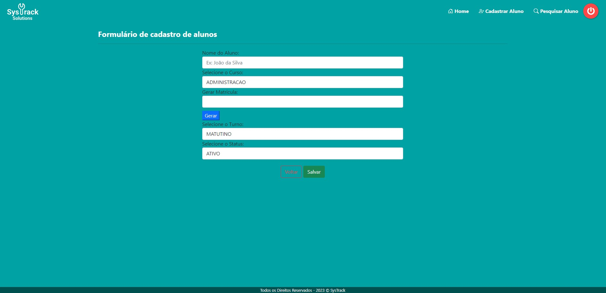
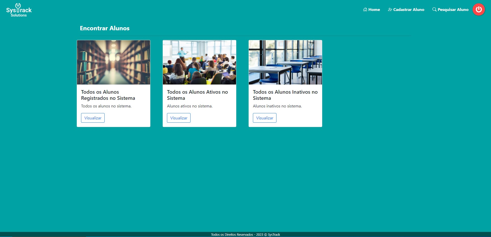
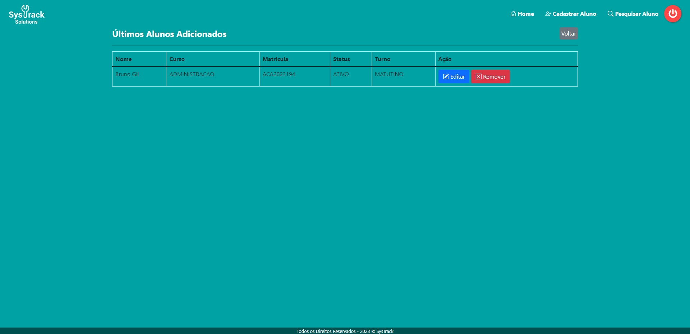

## Sobre o Projeto:

Uma aplicação web modelada no padrão MVC em Java e construída com o Spring Boot, o projeto conta com uma estrutura de CRUD, no qual os dados estão sendo persistidos em um banco de dados (MySQL). Na camada de visualização foi utilizado HTML, CSS, o framework Bootstrap e o template Thymeleaf.  Também foi utilizado o JavaScript para validação de uma regra de negócio. O sistema possui outras funcionalidades como, tela de login/cadastro, criptografia de dados do usuário, entre outras.
 
## Tecnologias Utilizadas

- Java
- Spring Boot
- JPA / Hibernate
- Maven
- HTML/CSS/JS
- Bootstrap
- MySQL

### Formulário de Cadastro


### Opções de Lista


### Lista de Alunos



## Banco de Dados

### Entidade Aluno


### Entidade Usuário


## Instalação

O projeto é gerenciado pelo Maven, então para usa-lo basta importa-lo para uma IDE.

## Configurações do banco de dados
Você pode criar um banco de dados MySQL com o nome o nome de sua preferência, porém é necessario adequar o projeto de acordo com as suas configurações. Para isso abra o arquivo application.properties, localizado em src/main/resources/application.properties e altere os seguintes comandos ao arquivo:

```
spring.datasource.url = Sua URL MySQL
spring.datasource.username = Seu username
spring.datasource.password = Sua Senha
```
 

## Execução
Execute o projeto através do IDE, abra um navegador de sua preferência e digite: http://localhost:8080
